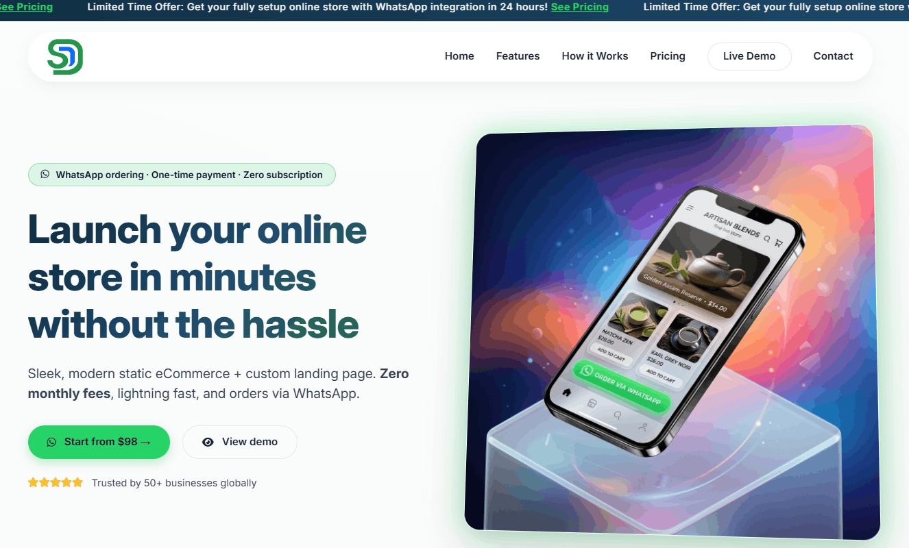
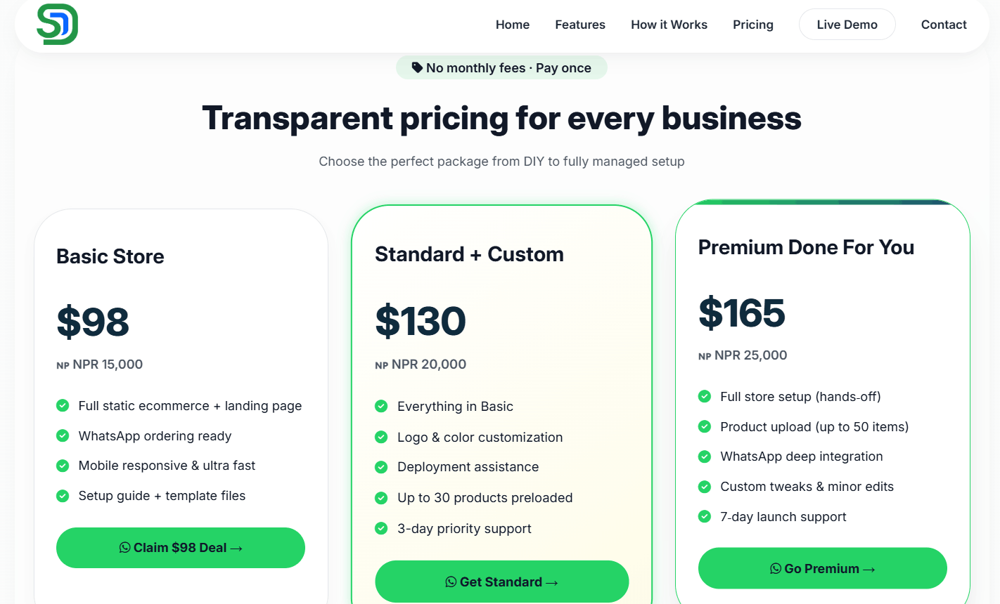
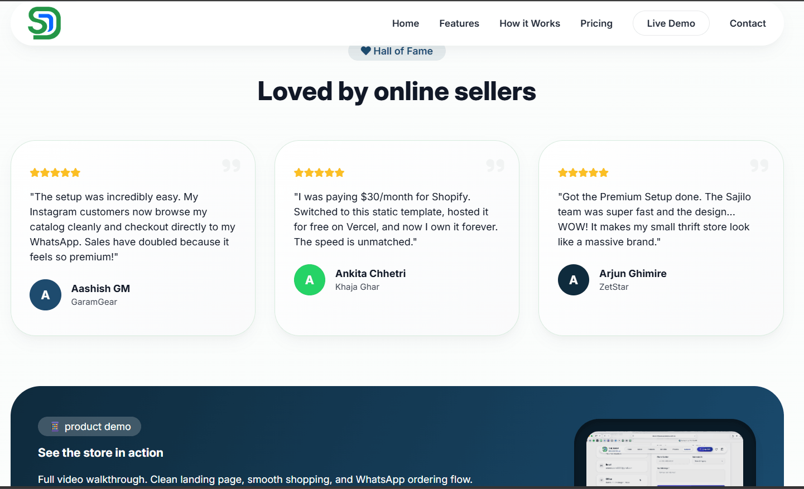
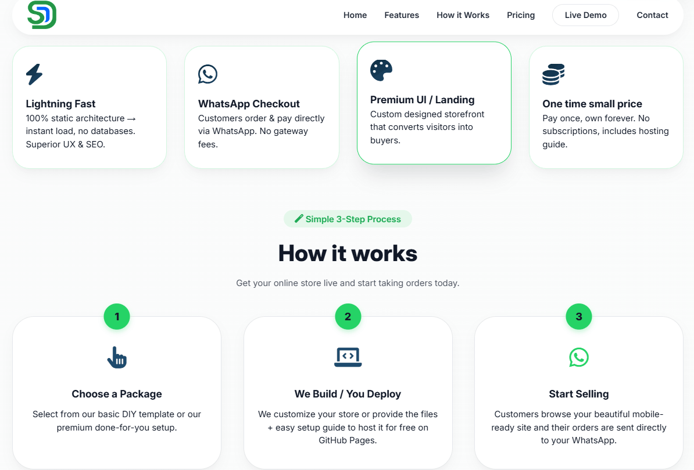
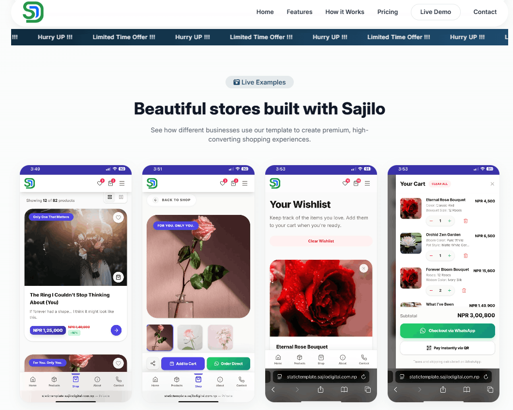

<p align="center">
 
 
 
 
 
 
</p>

<h1 align="center">Premium Product Landing Page Template</h1>
<p align="center">
 A production-ready, fully customizable Next.js landing page for any product.<br/>
 Built and maintained by <strong><a href="https://sajilodigital.com.np">SajiloDigital</a></strong> - Nepal's premium web agency.
</p>

---

## Images

<p align="center">





</p>

## What Is This?

This is SajiloDigital's **flagship product landing page template** designed to showcase and sell any physical or digital product beautifully. Clothing, electronics, health goods, SaaS tools, food products you name it. Built to impress at first glance and convert visitors into buyers.

Key highlights:

- **Config-driven** almost everything is controlled by 2 config files; no React knowledge required for basic rebranding
- **Full shopping cart** add-to-cart, QR payment, WhatsApp checkout, and localStorage persistence built-in
- **Premium animations** Framer Motion scroll-triggered fade-ins across every section
- **PWA-ready** ships with a `manifest.ts` for installable app support
- **Full legal pages** Privacy Policy and Terms & Conditions included

---

## Pages Included

| Page | Route | Description |
| ------------------ | ------------ | --------------------------------------------------- |
| Home | `/` | Full marketing landing page (9 sections) |
| About | `/about` | Brand story, vision & mission |
| Shop | `/shop` | Full product catalog with filtering + cart |
| Shop Detail | `/shop/[id]` | Individual product page with variants & Add to Cart |
| Contact | `/contact` | Contact form + address + social links |
| Privacy Policy | `/privacy` | Pre-built privacy policy page |
| Terms & Conditions | `/terms` | Pre-built T&C page |

---

## Sections on the Landing Page (`/`)

| Section | Component | Description |
| ----------------- | ---------------- | ----------------------------------------------------------------------- |
| **Navbar** | `Navbar.tsx` | Sticky, mobile-responsive navigation with cart icon + mobile bottom nav |
| **Hero** | `Hero.tsx` | Full-screen opener with animated headline, badge, and dual CTA buttons |
| **About (Short)** | `AboutShort.tsx` | Brand story snippet with image |
| **Trust Bar** | `Trust.tsx` | 5 trust-building feature badges |
| **Products** | `Products.tsx` | 3-card landing preview with WhatsApp Order + View buttons |
| **Benefits** | `Benefits.tsx` | 5 key product benefits with floating stat cards |
| **Process** | `Process.tsx` | 4-step how-it's-made visual cards |
| **FAQ** | `FAQ.tsx` | Animated accordion with configurable questions and answers |
| **CTA** | `CTA.tsx` | Final conversion section (WhatsApp / Shop / Call) |
| **Footer** | `Footer.tsx` | Contact info, quick links, social media, legal links |

> **Note:** The old 3-section landing page now includes a **FAQ** section between Process and CTA.

---

## Quick Start

```bash
# 1. Clone this repo
git clone https://github.com/arundada9000/Static-Landing-Page-Template-.git
cd Static-Landing-Page-Template-

# 2. Install dependencies
npm install

# 3. Copy environment file
cp .env.example .env
# Edit .env and set NEXT_PUBLIC_SITE_URL=https://yourclientdomain.com

# 4. Start dev server
npm run dev
```

Open [http://localhost:3000](http://localhost:3000) - the template is live!

---

## How to Rebrand for a New Client (3 Steps)

Almost everything lives in **2 config files**. You rarely need to touch React components.

### Step 1 `config/site.ts` · Identity, Contact & Payments

```typescript
export const siteConfig = {
 name: "ClientBrand", // ← Displayed in navbar, footer, SEO
 tagline: "Your One-Line Tagline",
 description: "SEO meta description...",
 url: "https://clientdomain.com",

 /** Logo - set to null to use the text monogram instead */
 logoSrc: "/images/circular-logo.png" as string | null,

 /** Open Graph image for social sharing (place in /public/images/) */
 ogImage: "/images/og-image.png",

 /** SEO keywords array */
 keywords: ["brand", "product", "premium"],

 contact: {
 phone: "+1 (800) 000-0000",
 email: "hello@client.com",
 address: "123 Street, City, Country",
 whatsapp: "10000000000", // ← International format, no + or spaces
 },

 social: {
 facebook: "https://facebook.com/client",
 instagram: "https://instagram.com/client",
 twitter: "https://twitter.com/client", // can also be a YouTube URL
 },

 /** QR payment options shown in the cart drawer */
 qrPayments: [
 { name: "eSewa", imageSrc: "/images/qr1.jpeg" },
 { name: "Khalti", imageSrc: "/images/qr2.jpeg" },
 ],
};

// Navigation links (desktop) - add/remove as needed
export const navLinks = [
 { label: "Home", href: "/" },
 { label: "About", href: "/about" },
 { label: "Products", href: "/#products" },
 { label: "Benefits", href: "/#benefits" },
 { label: "Process", href: "/#process" },
 { label: "Contact", href: "/contact" },
];

// Navigation links (mobile bottom bar)
export const mobileNavLinks = [
 { label: "Home", href: "/", icon: "Home" },
 { label: "Products", href: "/#products", icon: "Package" },
 { label: "Shop", href: "/shop", icon: "ShoppingBag" },
 { label: "About", href: "/about", icon: "Info" },
 { label: "Contact", href: "/contact", icon: "Phone" },
];
```

### Step 2 `config/content.ts` · All Page Copy & Images

Edit any section's text and Unsplash image URLs:

```typescript
// Hero section
export const heroContent = {
 badge: "Free Shipping · 30-Day Returns",
 headlineStart: "The World's Best",
 headlineHighlight: "Premium", // ← Gets the gradient effect
 headlineEnd: "Wireless Earbuds",
 subheadline: "Crystal-clear sound. All-day comfort.",
 heroImage: "https://images.unsplash.com/photo-XXXX?w=1920&q=80",
 primaryCTA: { label: "Shop Now", href: "/shop" },
 secondaryCTA: { label: "Learn More", href: "/about" },
};

// FAQ section - add/remove items freely
export const faqItems = [
 {
 id: "faq-1",
 question: "What is your return policy?",
 answer: "We offer a 30-day hassle-free return policy...",
 },
 // ... more items
];

// About, Trust, Benefits, Process, CTA, Footer - all configurable the same way
```

### Step 3 `app/data/allProducts.ts` · Full Shop Catalog

This file powers both the `/shop` listing page and individual `/shop/[id]` product pages. Add a new object to the array and the entire UI updates automatically:

```typescript
export const allProducts: ShopProduct[] = [
 {
 id: "unique-slug", // ← Used as the URL: /shop/unique-slug
 name: "Product Name",
 shortDescription: "One-liner for listing cards.",
 longDescription: "Full description shown on the detail page.",
 price: 5000, // In CURRENCY units (see below)
 originalPrice: 6500, // Optional - shows struck-through sale price
 images: [
 "https://images.unsplash.com/photo-XXXX?w=900&q=80",
 "https://images.unsplash.com/photo-YYYY?w=900&q=80",
 ],
 category: "Watches", // Must match an entry in shopCategories[]
 badge: "Bestseller", // Optional: "New" | "Sale" | "Limited" | "Trending" | any string
 tags: ["Premium", "Leather"],
 features: ["Feature one", "Feature two"],
 options: [
 { id: "size", name: "Size", choices: ["S", "M", "L", "XL"] },
 { id: "color", name: "Color", choices: ["Black", "White"] },
 ],
 active: true, // Set false to soft-hide without deleting
 },
];

// Change currency symbol once here - used across all price displays
export const CURRENCY = "NPR ";

// Categories that appear in the filter bar on /shop
export const shopCategories = [
 "All",
 "Watches",
 "Accessories",
 "Bags",
 "Apparel",
];
```

---

## The Shopping Cart System

The template includes a **fully functional cart** with no external services required.

### How It Works

1. Customer visits `/shop`, browses products, clicks a card → goes to `/shop/[id]`
2. On the detail page they pick variants (size, color, etc.) and click **Add to Cart**
3. Cart icon in the Navbar shows a live item count badge
4. Clicking the icon slides open the **Cart Drawer** from the right
5. Customer can adjust quantities, remove items, or checkout via:
 - **WhatsApp** generates a pre-filled WhatsApp message with the full order summary and opens `wa.me`
 - **QR Pay** shows a scannable QR code (eSewa / Khalti / any method) and then sends a "PAID VIA QR" WhatsApp message

### Cart Persistence

Cart contents are saved to `localStorage` (`shop_cart_v1`) and restored on page load - items survive refreshes and tab closes.

### Configuring QR Payments

Place your QR images in `/public/images/` and update `siteConfig.qrPayments`:

```typescript
qrPayments: [
 { name: "eSewa", imageSrc: "/images/esewa-qr.jpeg" },
 { name: "Khalti", imageSrc: "/images/khalti-qr.jpeg" },
],
```

Multiple QR options show as tabs in the cart drawer. A download button lets customers save the QR to their phone.

To use a **single payment method** - just add one entry; the tab UI is hidden automatically.

---

## Animation System

All animations use **Framer Motion** (v12). Two layers are used:

### `<FadeIn>` Component (`app/components/FadeIn.tsx`)

A reusable scroll-triggered wrapper used across every section:

```tsx
import { FadeIn } from "@/app/components/FadeIn";

<FadeIn delay={0.2} direction="up">
 <p>This fades in from below when scrolled into view.</p>
</FadeIn>;
```

| Prop | Type | Default | Description |
| ----------- | ----------------------------------------------- | ------- | ----------------------------------- |
| `delay` | `number` | `0` | Seconds before the animation starts |
| `direction` | `"up" \| "down" \| "left" \| "right" \| "none"` | `"up"` | Slide direction before fade |
| `className` | `string` | `""` | Passed to the wrapping `motion.div` |

### CSS Animation Utilities (`app/globals.css`)

Ready-to-use classes for decorative elements:

| Class | Effect |
| ---------------------- | ----------------------------------- |
| `.animate-float` | Gentle 6s up/down float |
| `.animate-float-slow` | Slow 9s float with horizontal drift |
| `.animate-pulse-glow` | Pulsing primary-color box shadow |
| `.animate-shimmer` | Left-to-right shimmer sweep |
| `.animate-slide-up` | One-time slide-up on load |
| `.animate-scale-in` | One-time scale-in on load |
| `.animate-spin-slow` | Slow 20s rotation |
| `.animate-fade-in-up` | One-time fade + upward slide |
| `.animate-bounce-soft` | Soft 2s vertical bounce |
| `.gradient-animated` | Continuously shifting gradient |
| `.hover-lift` | Hover: lift card with shadow |
| `.glass-card` | Glassmorphism backdrop blur |
| `.delay-{100-1000}` | Animation delay helpers |

---

## Changing the Color Scheme

All colors are in **one place** - `app/globals.css`:

```css
@theme inline {
 --color-primary: #4f46e5; /* Main brand color - change this! */
 --color-primary-light: #818cf8; /* Hover states */
 --color-primary-dark: #3730a3; /* Dark section backgrounds */
 --color-primary-50: #eef2ff; /* Light tint backgrounds */
 --color-primary-100: #c7d2fe; /* Border colors */
 --color-accent: #f59e0b; /* Gold highlights & gradients */
 --color-accent-light: #fde68a; /* Lighter gold */
 --color-secondary: #f8f7ff; /* Light surface tint */
 --color-secondary-dark: #e8e6f5;
 --color-surface: #ffffff;
 --color-surface-alt: #fafafa;
 --color-border: #e8e0ff;
 --color-muted: #78716c;
 --color-heading: #1c1917;
 --color-body: #44403c;
}
```

**Every component automatically inherits these.** Just change one hex value and the whole site repaints.

### Color Presets by Industry

| Industry | `--color-primary` | `--color-accent` |
| ---------------------- | -------------------- | ---------------- |
| **Health / Wellness** | `#059669` emerald | `#F59E0B` amber |
| **Tech / SaaS** | `#3B82F6` blue | `#8B5CF6` violet |
| **Luxury / Fashion** | `#1C1917` near-black | `#D97706` gold |
| **Food & Beverage** | `#16A34A` green | `#CA8A04` golden |
| **Beauty / Cosmetics** | `#EC4899` pink | `#F59E0B` amber |
| **Sports / Fitness** | `#DC2626` red | `#F97316` orange |

---

## Sourcing Images (Unsplash)

1. Go to [unsplash.com](https://unsplash.com), search for the client's product category
2. Click any photo → copy the browser URL
3. Extract the photo ID (e.g. `photo-1523275335684-37898b6baf30`)
4. Format: `https://images.unsplash.com/photo-XXXXXX?w=1920&q=80`
5. Paste into `config/content.ts` or `app/data/allProducts.ts`

> **For production:** Replace Unsplash URLs with the client's actual product photography on their CDN for best performance. Unsplash images are only for prototyping.

---

## Project Structure

```
├── config/
│ ├── site.ts ← Brand, contact, social, QR payments, nav links
│ └── content.ts ← All section copy, images, features, steps, FAQ items
│
├── app/
│ ├── data/
│ │ ├── products.ts ← 3 featured product cards on the landing page
│ │ └── allProducts.ts ← Full shop catalog (ShopProduct type, CURRENCY, helpers)
│ │
│ ├── context/
│ │ └── CartContext.tsx ← Cart state, localStorage persistence, WhatsApp checkout
│ │
│ ├── components/ ← Shared UI sections
│ │ ├── Navbar.tsx ← Sticky navbar + mobile bottom nav + cart icon
│ │ ├── Hero.tsx ← Full-screen hero
│ │ ├── AboutShort.tsx ← Brand story snippet
│ │ ├── Trust.tsx ← Trust badge bar
│ │ ├── Products.tsx ← 3-card landing product preview
│ │ ├── Benefits.tsx ← Benefits grid with stat cards
│ │ ├── Process.tsx ← How-it's-made steps
│ │ ├── FAQ.tsx ← Animated accordion FAQ
│ │ ├── CTA.tsx ← Conversion CTA section
│ │ ├── Footer.tsx ← Footer with links, social, legal
│ │ ├── CartDrawer.tsx ← Slide-in cart with QR pay & WhatsApp checkout
│ │ └── FadeIn.tsx ← Reusable Framer Motion scroll-trigger wrapper
│ │
│ ├── about/
│ │ └── page.tsx ← Full About page
│ │
│ ├── shop/
│ │ ├── page.tsx ← Shop listing with search, category, badge & price filters
│ │ └── [id]/page.tsx ← Individual product detail page with image gallery & cart
│ │
│ ├── contact/
│ │ ├── layout.tsx ← Contact page SEO metadata
│ │ └── page.tsx ← Contact form + map/address section
│ │
│ ├── privacy/
│ │ ├── layout.tsx ← Privacy page SEO metadata
│ │ └── page.tsx ← Privacy Policy content
│ │
│ ├── terms/
│ │ ├── layout.tsx ← Terms page SEO metadata
│ │ └── page.tsx ← Terms & Conditions content
│ │
│ ├── globals.css ← Color tokens, animation keyframes, utility classes
│ ├── layout.tsx ← Root layout: SEO metadata, CartProvider, CartDrawer
│ ├── manifest.ts ← PWA web app manifest (auto-reads from siteConfig)
│ ├── icon.png ← App icon
│ └── apple-icon.png ← Apple touch icon
│
├── public/
│ └── images/ ← Place OG image, logo, QR codes here
│ ├── og-image.png ← 1200×630px Open Graph image
│ ├── circular-logo.png
│ ├── qr1.jpeg
│ └── qr2.jpeg
│
├── next.config.ts ← Image domain allowlist
├── .env ← NEXT_PUBLIC_SITE_URL
└── README.md
```

---

## SEO & PWA

The template ships with full metadata coverage out of the box via `app/layout.tsx`:

- **Title & description** auto-generated from `siteConfig.name` and `siteConfig.tagline`
- **OpenGraph** og:title, og:description, og:image (1200×630)
- **Twitter Card** `summary_large_image`
- **Keywords** pulled from `siteConfig.keywords[]`
- **Favicon & Apple icon** set via `siteConfig.logoSrc`
- **Web App Manifest** `app/manifest.ts` reads `siteConfig` automatically
- **Viewport** theme color, mobile-optimised scale

Each legal/content page (`/contact`, `/privacy`, `/terms`) has its own `layout.tsx` with dedicated metadata.

---

## Deploying for a Client

### Recommended: Vercel (free tier, ideal for landing pages)

```bash
# 1. Verify build is clean
npm run build

# 2. Deploy
npx vercel --prod
```

Set `NEXT_PUBLIC_SITE_URL=https://clientdomain.com` in Vercel's **Environment Variables** dashboard.

### Self-Hosted / VPS

```bash
npm run build
npm start # Runs on port 3000
```

Use nginx as a reverse proxy to point the domain to port 3000.

---

## Client Launch Checklist

### Branding & Content

- [ ] `config/site.ts` name, tagline, logo, contact details, WhatsApp number, social links
- [ ] `config/site.ts` `qrPayments` array with correct QR image paths
- [ ] `config/content.ts` all section copy and Unsplash image URLs replaced with real client images
- [ ] `app/data/products.ts` 3 landing-page featured products updated
- [ ] `app/data/allProducts.ts` full shop catalog with real products, prices, options

### Design

- [ ] `app/globals.css` `--color-primary` matches client brand color
- [ ] `/public/images/og-image.png` 1200×630px Open Graph image
- [ ] `/public/images/circular-logo.png` circular logo for favicon & navbar

### Technical

- [ ] `.env` `NEXT_PUBLIC_SITE_URL` set to client's domain
- [ ] `next.config.ts` image domains updated if using non-Unsplash image hosts
- [ ] `npm run build` zero TypeScript/lint errors
- [ ] Tested on mobile (iOS + Android via DevTools) and desktop
- [ ] Custom domain connected in hosting dashboard

### Legal

- [ ] `/privacy/page.tsx` update company name and contact details within the copy
- [ ] `/terms/page.tsx` update company name and terms copy

---

## Tech Stack

| Tech | Version | Role |
| ----------------------------------------------- | ------- | ------------------------------------------------ |
| [Next.js](https://nextjs.org) | 16.2 | React framework (App Router) |
| [React](https://react.dev) | 19 | UI library |
| [Tailwind CSS](https://tailwindcss.com) | v4 | Utility-first CSS with `@theme` tokens |
| [TypeScript](https://typescriptlang.org) | 5 | Type safety |
| [Framer Motion](https://www.framer.com/motion/) | 12 | Scroll-triggered animations & cart drawer |
| [Lucide React](https://lucide.dev) | latest | Icon library |
| [Unsplash](https://unsplash.com) | - | Placeholder photography (replace for production) |

---

## Built by SajiloDigital

<p align="center">
 <strong>
 <a href="https://sajilodigital.com.np">sajilodigital.com.np</a>
 </strong>
 <br/>
 Nepal's premier web design & development agency.<br/>
 We build premium digital products for Nepali and global businesses.
</p>
<p align="center">
 
</p>

> **Need a custom website, e-commerce store, or a full digital strategy?** 
> Reach out at [sajilodigital.com.np](https://sajilodigital.com.np)

---

_
## License

This project is for educational and personal learning purposes only. Commercial use, public deployment, or any revenue-generating use requires explicit written permission from the author. See [LICENSE](LICENSE) for details.

_© SajiloDigital. Created by Arun Neupane.__
